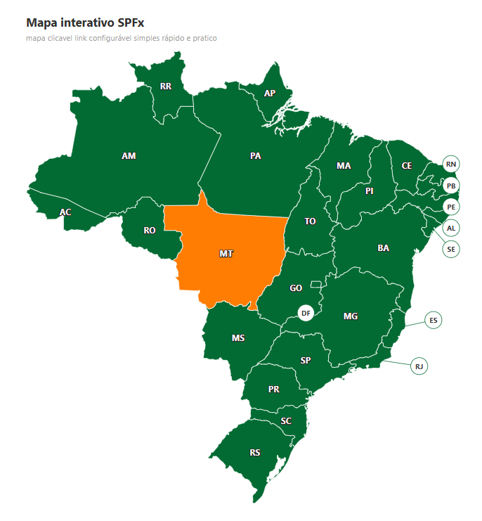

# InteractiveMap

Web part de mapa interativo do Brasil (SVG), com os 27 estados como regiões clicáveis. Pensada para uso em intranet: cada estado tem sua sigla, cor configurável e um link de destino cadastrado no painel de propriedades. Ao clicar em um estado, uma animação de zoom antecede o redirecionamento.



## Status

| Item | Funcionalidade | Status |
|----|-----------------|--------|
| F1 | Mapa SVG do Brasil | ✅ Feito |
| — | Título e subtítulo opcionais acima do mapa (fora do backlog original, incluído junto ao F1) | ✅ Feito |
| F2 | Sigla visível por estado | ✅ Feito |
| F3 | Cores do mapa configuráveis | ✅ Feito |
| F4 | Cadastro de link obrigatório por estado | ✅ Feito (inclui a navegação ao clicar) |
| F5 | Layout responsivo | ⏸️ Em pausa |
| F6 | Animação de zoom antes do redirecionamento | ⬜ Não iniciado (a navegação já existe desde o F4; falta a animação antes dela) |
| F7 | Acessibilidade por teclado | ❌ Descartado |

**Replanejamento (2026-09-25):** depois do F4, a próxima funcionalidade é o F6. O F5 ficou em pausa. O F7 foi descartado por decisão do dono do projeto: o mapa funciona com mouse e toque, mas não com teclado nem leitor de tela. As seções "Dependências" e "Ordem sugerida" abaixo são o planejamento original e continuam citando o F7 como referência histórica.

## Backlog

### Resumo

A web part InteractiveMap será usada em uma intranet e exibe um mapa SVG do Brasil com os estados
clicáveis, cada um identificado por sua sigla. As cores do mapa e os links de destino de cada estado
são configuráveis pelo painel de propriedades (o link de cada estado é cadastrado em uma lista de
propriedades). O foco principal é ser responsiva, ajustando-se ao espaço onde for inserida, com boa
aparência visual, e apresentar uma animação de destaque (zoom no estado selecionado) antes de
redirecionar o usuário para o link configurado.

### Funcionalidades

| ID | Funcionalidade | Descrição | Prioridade |
|----|-----------------|-----------|------------|
| F1 | Mapa SVG do Brasil | Renderizar o mapa do Brasil em SVG com todos os 27 estados/UFs como elementos clicáveis. | Alta |
| F2 | Sigla visível por estado | Cada estado exibe sua sigla (UF) sobreposta ou vinculada à sua região no mapa. | Alta |
| F3 | Cores do mapa configuráveis | Cor base e cor de hover/destaque, globais (aplicadas a todos os estados), controladas via painel de propriedades. | A definir |
| F4 | Cadastro de links por estado (obrigatório) | Lista no painel de propriedades para cadastrar a URL de cada um dos 27 estados. O link é obrigatório para todos os estados; a configuração não deve ser considerada válida com algum estado sem link. | A definir |
| F5 | Layout responsivo | O mapa se ajusta ao espaço (largura/altura) do container onde a web part é inserida. | Alta |
| F6 | Animação de zoom antes do redirecionamento | Ao clicar num estado, uma animação de zoom/ampliação no estado selecionado acontece antes de navegar para o link configurado. | Alta |
| F7 | Acessibilidade por teclado | Foco visível nos estados, navegação via Tab entre estados, ativação via Enter/Espaço disparando o mesmo comportamento do clique (incluindo a animação de zoom em F6). | Alta |

### Dependências

- F2 depende de F1 (precisa dos estados já desenhados para sobrepor/vincular a sigla).
- F3 depende de F1 (precisa dos estados como elementos estilizáveis antes de expor cor via property pane).
- F4 depende de F1 (precisa da lista de estados/UFs definida para gerar os 27 campos do property pane).
- F3 e F4 não dependem entre si — são independentes (estilo vs. dado/navegação) e podem ser desenvolvidas em qualquer ordem ou em paralelo.
- F6 depende de F1 e F4 (a animação e o redirecionamento não fazem sentido sem o link de destino existir; como o link é obrigatório em F4, F6 só é testável de ponta a ponta depois que a validação de F4 estiver funcionando).
- F7 depende de F1 e F6 (a ativação por teclado deve reaproveitar a mesma lógica de disparo — animação + redirecionamento — já implementada em F6, evitando implementar o comportamento duas vezes).
- F5 depende de F1 (o SVG precisa existir para ter o que redimensionar); não depende de F3, F4, F6 ou F7 por ser transversal ao conteúdo interativo, mas faz mais sentido validar depois de F2, já que texto sobreposto (siglas) costuma ser o que mais quebra em telas pequenas.

### Ordem sugerida de desenvolvimento

1. F1 — base de tudo, nenhum outro item existe sem o mapa renderizado.
2. F2 — depende só de F1, fecha a identificação visual dos estados.
3. F3 — depende só de F1, independente de F4; pode ser feita aqui ou em paralelo com F4.
4. F4 — depende só de F1, independente de F3; pode ser feita aqui ou em paralelo com F3.
5. F5 — depende de F1, faz mais sentido validar com F2 (siglas) já implementado.
6. F6 — depende de F1 e F4 (link obrigatório precisa estar funcionando para testar o redirecionamento).
7. F7 — depende de F1 e F6 (reaproveita a lógica de disparo já criada em F6).

## Decisões técnicas — F2 (sigla por estado)

- **Posicionamento da sigla:** cada estado tem um `centroid` pré-calculado salvo em `BrazilMapData.ts`, usado para posicionar o `<text>` da sigla. Calculado uma vez com um script utilitário (não faz parte do build) a partir da geometria de cada estado — não é recalculado em runtime. O cálculo usa o **centroide de área do polígono** (fórmula shoelace) do maior subpath do estado, não uma média simples dos pontos do contorno — a média simples foi tentada primeiro e falhava em formas irregulares/côncavas (ex.: Pará, Acre), posicionando a sigla fora da região. Para estados com múltiplos subpaths (ilhas/exclaves costeiros, ex.: Pará tem 26), usa-se o subpath de maior área, para uma ilha pequena não deslocar a posição da sigla do continente principal.
- **Estados com callout:** Rio Grande do Norte, Paraíba, Pernambuco, Alagoas, Sergipe, Distrito Federal, Rio de Janeiro e Espírito Santo (8 estados) são pequenos ou ficam muito próximos de vizinhos no Nordeste, tornando a sigla ilegível ou sobreposta se colocada direto na região. Para esses, a sigla fica num círculo ligado ao centroide do estado por uma linha (`calloutPosition`, pré-calculado e fixo em `BrazilMapData.ts`). RN/PB/PE/AL/SE ficam empilhados em uma coluna vertical junto à borda direita do mapa (ordenados de cima para baixo pela posição de cada estado, para as linhas não se cruzarem). **DF é um caso à parte:** por ser um enclave cercado por Goiás (GO) em todos os lados, seu callout fica dentro do próprio Goiás — posição validada por point-in-polygon (dentro da forma real de GO, não só do bounding box) e com distância mínima de ~25px até a sigla "GO", para não sobrepor. RJ e ES ficam fora do mapa, na área de oceano próxima. Os outros 19 estados exibem a sigla direto sobre o centroide.
- **Acessibilidade das siglas:** os elementos `<text>`/`<g>` de sigla e callout têm `aria-hidden="true"` — o nome completo de cada estado já é lido via `<title>` dentro do `<path>` (leitor de tela não deve anunciar a sigla duas vezes).
- **Área clicável — callout vs. estado:** para os 8 estados com `calloutPosition`, o alvo de clique é o **círculo do callout**, não a própria região do estado no mapa (o `<path>` fica `aria-hidden` e sem `onClick`) — a região é pequena/apertada demais para ser um alvo de clique confiável. Para os outros 19 estados (sem `calloutPosition`), o alvo de clique é a **própria região do estado**. Essa regra vem diretamente do dado: `InteractiveMap.tsx` decide onde colocar o `onClick` checando se `state.calloutPosition` existe, não uma lista separada — não há como o componente e os dados divergirem nisso.
- **Validação automatizada:** `BrazilMapData.test.ts` garante, a cada build, que os 27 estados têm UF/nome/path/centroide válidos, sem duplicidade, que o centroide de cada estado cai dentro do próprio bounding box (pegaria o bug do centroide fora da forma de Pará/Acre automaticamente), e que a lista de UFs com callout é exatamente a esperada (RN, PB, PE, AL, SE, DF, RJ, ES) — protege a regra de área clicável acima contra mudança acidental nos dados.

## Decisões técnicas — F3 (cores configuráveis)

- **Campo de cor:** `PropertyFieldColorPicker` do `@pnp/spfx-property-controls` (versão fixa `3.24.0`, a que declara compatibilidade com SPFx 1.23 e React 17.0.1). É carregado sob demanda em `loadPropertyPaneResources`, num chunk separado (`interactive-map-property-pane`, ~230 KB): quem só visualiza a página não baixa esse código, só quem abre o painel de propriedades.
- **Padrão = tema:** as duas cores são opcionais. Enquanto não forem configuradas, o mapa usa as cores do tema do SharePoint (o mesmo visual de antes do F3). Por isso não há valor padrão no manifest nem mudança de `dataVersion`: páginas que já usavam a web part continuam iguais.
- **Como a cor chega no mapa:** o componente expõe as cores como variáveis CSS (`--mapBaseColor`, `--mapHoverColor`) no elemento raiz, e o SCSS usa `var(--mapBaseColor, <cor do tema>)`. Cor não configurada = variável ausente = tema. A regra fica em `components/mapColors.ts`, coberta por `mapColors.test.ts`.
- **Onde cada cor se aplica:** a cor dos estados preenche as regiões e também colore a linha e a borda dos callouts. A cor de destaque aparece no hover e na seleção, tanto nas regiões quanto nos círculos de callout.
- **Seletor mostra a cor real:** sem cor configurada, o seletor abre já com a cor efetiva do tema, e não com um valor genérico que não corresponde ao que está na tela.
- **Voltar ao tema:** o botão "Usar cores do tema" limpa as duas cores. Sem ele, depois de escolher uma cor não haveria como voltar ao padrão do tema. O botão fica desabilitado quando nenhuma cor está configurada.
- **Contraste das siglas:** com uma cor clara escolhida no painel, a sigla branca ficaria ilegível. As siglas sobre regiões coloridas (e a sigla do callout quando o círculo está em hover/selecionado) usam texto claro com contorno escuro (`paint-order: stroke`), as duas cores vindas do tema, o que mantém a leitura sobre qualquer cor de fundo.
- **Limitação conhecida:** o pacote PnP não traz tradução pt-br (só pt-pt). Em páginas em português, os textos internos do seletor de cor aparecem em inglês; os rótulos dos campos, que vêm das strings desta web part, continuam em pt-br.

## Decisões técnicas — F4 (links por estado)

- **Cadastro:** o painel de propriedades ganhou uma segunda página, "Links", com um campo de URL por estado, agrupados por região (Norte, Nordeste, Centro-Oeste, Sudeste, Sul — definidas em `components/data/brazilRegions.ts`). Os links ficam num único objeto `stateLinks` indexado pela UF (`stateLinks.SP`, `stateLinks.RJ`...), em vez de 27 propriedades soltas; o SPFx grava caminhos aninhados do painel com `lodash.update`, então isso funciona nativamente.
- **Endereços aceitos:** `https://` ou `http://` absoluto, ou caminho do próprio tenant começando com `/` (ex.: `/sites/rh/SitePages/sp.aspx`). Qualquer outro esquema (`javascript:`, `mailto:`, `ftp:`...) e endereços que levam a outro site disfarçados de caminho (`//host`, `/\host`) são recusados, porque o link é aberto no clique. As regras ficam em `components/stateLinks.ts`, cobertas por `stateLinks.test.ts`.
- **Obrigatório, mas sem bloquear a página:** o SPFx não consegue impedir a publicação da página com campos vazios. O campo vazio ou inválido mostra erro no painel e não é gravado. No modo de edição, um aviso lista os estados ainda sem link, com botão que abre o painel. Para quem visualiza a página, um estado sem link válido aparece normal no mapa, mas sem cursor de mão, sem cor de hover e sem reação ao clique.
- **Navegação:** o clique abre o link na mesma aba; o interruptor "Abrir links em nova aba" muda para nova aba (com `noopener`). A navegação já faz parte do F4 para a funcionalidade ser testável de ponta a ponta; o F6 vai só acrescentar a animação de zoom antes dela.
- **Sem navegação no modo de edição:** enquanto a página está sendo editada, o clique só destaca o estado. Navegar tiraria o autor da página no meio da edição.
- **Link validado duas vezes:** o painel não grava link inválido, e o mapa ainda confere o link antes de navegar, o que cobre dados antigos ou alterados fora do painel.
- **Bundle:** o aviso do modo de edição usa o `MessageBar` do Fluent UI e é carregado sob demanda (`React.lazy`, chunk `interactive-map-edit-warning`). Importado direto, ele levava o bundle principal de 80 KB para 285 KB, pago por todo visitante da página por algo que só autores veem. Com o carregamento sob demanda, o bundle principal ficou em ~84 KB.
- **Correção junto com o F4:** um callout selecionado não mudava de cor (a regra do círculo branco vencia a de seleção por vir depois no CSS). Agora o círculo selecionado usa a cor de destaque, como as regiões.

## Propriedades (painel de propriedades)

| Propriedade | Tipo | Obrigatória | Descrição |
|---|---|---|---|
| Título | Texto | Não | Exibido acima do mapa. Fica oculto se vazio. |
| Subtítulo | Texto | Não | Exibido abaixo do título. Fica oculto se vazio. |

| Cor dos estados | Cor | Não | Preenchimento dos estados, e linha/borda dos callouts. Sem valor, usa a cor do tema. |
| Cor de destaque (hover e seleção) | Cor | Não | Cor do estado ou do callout ao passar o mouse e quando selecionado. Sem valor, usa a cor do tema. |
| Usar cores do tema | Botão | — | Limpa as duas cores acima e volta ao padrão do tema. |

Página **Links**:

| Propriedade | Tipo | Obrigatória | Descrição |
|---|---|---|---|
| Abrir links em nova aba | Sim/Não | Não | Desligado (padrão): o link abre na mesma aba. Ligado: abre em nova aba. |
| Um campo por estado (27), agrupados por região | Texto (URL) | Sim | Link de destino do estado: `https://...`, `http://...` ou caminho do tenant começando com `/`. Valor vazio ou inválido mostra erro e não é gravado. |

## Estrutura de código

```
InteractiveMapWebPart.ts        # classe da web part, property pane
components/
  InteractiveMap.tsx            # componente React que renderiza o mapa
  InteractiveMap.module.scss    # estilos (cores do tema)
  IInteractiveMapProps.ts       # props do componente
  data/BrazilMapData.ts         # geometria dos 27 estados (extraída de um SVG MapSVG)
  data/BrazilMapData.test.ts    # valida integridade dos dados dos 27 estados
  mapColors.ts                  # cores do painel -> variáveis CSS (fallback para o tema)
  mapColors.test.ts             # garante o fallback para o tema quando não há cor configurada
  stateLinks.ts                 # validação e resolução dos links dos estados
  stateLinks.test.ts            # endereços aceitos/recusados, estados sem link
  MissingLinksWarning.tsx       # aviso de links pendentes (modo de edição, carregado sob demanda)
  data/brazilRegions.ts         # regiões e seus estados (agrupa os campos de link no painel)
  data/brazilRegions.test.ts    # garante que os 27 estados estão em exatamente uma região
loc/                             # textos de interface (en-us, pt-br)
assets/InteractiveMap.png        # print usado neste README (não entra no pacote)
```

O modelo `IBrazilState` (uf, name, path, centroid, calloutPosition opcional) fica em `src/models/`, fora da pasta da web part, para poder ser reaproveitado por serviços/hooks futuros (ex.: opções do property pane em F4).

## Como usar

1. Adicionar a web part InteractiveMap a uma página.
2. No painel de propriedades, preencher Título/Subtítulo (opcional).
3. Em **Cores**, escolher a cor dos estados e a cor de destaque (opcional). "Usar cores do tema" volta ao padrão.
4. Na página **Links** do painel, informar o link de cada estado (todos obrigatórios) e, se quiser, ligar "Abrir links em nova aba". Enquanto faltar algum link, o modo de edição mostra um aviso com os estados pendentes.
5. Publicar a página: quem visualiza clica no estado (ou no círculo do callout, nos estados pequenos) e vai para o link configurado.

## Histórico de versões

| Versão | Data       | Comentário |
| ------ | ---------- | --------- |
| 0.1.0  | 2026-09-25 | Scaffold inicial (placeholder do Yeoman, sem funcionalidade própria) |
| 0.1.0  | 2026-09-25 | F1: mapa SVG do Brasil renderizado com os 27 estados como regiões clicáveis |
| 0.1.0  | 2026-09-25 | Título e subtítulo opcionais acima do mapa, configuráveis via property pane |
| 0.1.0  | 2026-09-25 | Build de produção (`npm run build`) validado com sucesso: zero erros, zero warnings, `.sppkg` gerado; chaves de localização en-us/pt-br sincronizadas |
| 0.1.0  | 2026-09-25 | F2: sigla (UF) visível em cada estado, com callout (círculo + linha) para os 5 estados menores (DF, SE, AL, RJ, ES) |
| 0.1.0  | 2026-09-25 | Build de produção validado novamente após F2: zero erros, zero warnings, `.sppkg` gerado |
| 0.1.0  | 2026-09-25 | F2 (ajuste): callout expandido para 8 estados (+ RN, PB, PE, que colidiam com AL/SE no Nordeste), fonte das siglas aumentada, e teste automatizado (`BrazilMapData.test.ts`) validando integridade dos dados dos 27 estados |
| 0.1.0  | 2026-09-25 | Build de produção validado novamente após o ajuste: zero erros, zero warnings, 5/5 testes passando, `.sppkg` gerado |
| 0.1.0  | 2026-09-25 | Correção: cálculo de centroide trocado de média de pontos para centroide de área (shoelace), corrigindo sigla fora da forma em Pará e Acre; adicionado teste que valida centroide dentro do bounding box de cada estado |
| 0.1.0  | 2026-09-25 | Build de produção validado após a correção: zero erros, zero warnings, 6/6 testes passando, `.sppkg` gerado |
| 0.1.0  | 2026-09-25 | Callout do DF movido para dentro de Goiás (estado que o cerca por completo), sem sobrepor a sigla "GO"; posição validada por point-in-polygon |
| 0.1.0  | 2026-09-25 | Build de produção validado após o ajuste do callout do DF: zero erros, zero warnings, 6/6 testes passando, `.sppkg` gerado |
| 0.1.0  | 2026-09-25 | Área clicável separada por tipo de estado: os 8 estados com callout ficam clicáveis no círculo do callout (não mais na região do estado), os outros 19 continuam clicáveis na própria região; teste garante que a lista de estados com callout é exatamente a esperada |
| 0.1.0  | 2026-09-25 | Build de produção validado após o ajuste de área clicável: zero erros, zero warnings, 7/7 testes passando, `.sppkg` gerado |
| 0.1.0  | 2026-09-25 | F3: cores configuráveis no painel de propriedades (cor dos estados e cor de destaque), com fallback para o tema quando não configuradas, botão "Usar cores do tema" e contorno nas siglas para manter o contraste sobre qualquer cor; seletor de cor do PnP carregado sob demanda |
| 0.1.0  | 2026-09-25 | Build de produção validado após o F3: zero erros, zero warnings, 11/11 testes passando, `.sppkg` gerado; bundle principal com 80 KB e o seletor de cor em chunk separado |
| 0.1.0  | 2026-09-25 | F4: link obrigatório por estado em uma página "Links" do painel (agrupada por região), com validação de endereço; clique navega para o link (mesma aba ou nova aba, configurável), exceto no modo de edição; estados sem link não reagem ao clique; aviso de links pendentes no modo de edição, carregado sob demanda |
| 0.1.0  | 2026-09-25 | Correção: callout selecionado agora usa a cor de destaque (antes continuava branco) |
| 0.1.0  | 2026-09-25 | Build de produção validado após o F4: zero erros, zero warnings, 38/38 testes passando, `.sppkg` gerado; bundle principal com ~84 KB |
| 0.1.0  | 2026-09-25 | README: print do mapa adicionado; replanejamento do backlog (F6 a seguir, F5 em pausa, F7 descartado) |

## Referências

- Backlog original (entrevista de descoberta): `docs/backlog/interactive-map.md` — arquivo local, de uso pessoal, não versionado (a seção "Backlog" acima é a cópia mantida no repositório).
- [MapSVG — formato do mapa SVG de origem](http://mapsvg.com)
